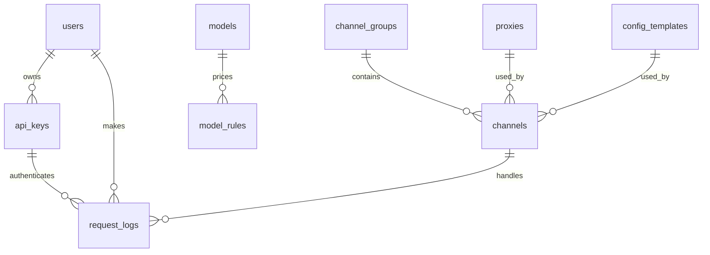

# 数据库设计（首版简化方案）

> 状态：设计基线已由迁移实现，服务通过数据库 repository 编译控制面快照。本版本只保留 [`PRD.md`](PRD.md) 明确列出的 11 张表；不新增授权关联表、价格版本表、路由目标表、账本表、配置版本表或渠道运行状态表。

## 1. 设计原则

- 数据库保存**当前控制面配置**与**不可丢失的请求/审计事实**。
- 一个 API Key 的归属、格式限制、权限、可用分组、限流与额度都在 `api_keys` 一行中。
- 一个模型的当前价格都在 `models` 一行中。价格更新覆盖该行；`request_logs` 保存实际使用的完整单价快照，历史费用不依赖当前价格。
- 一个规则的多个渠道组/渠道目标使用数组字段，不建立关联表。由控制面编译器验证数组中 ID 的存在性、格式与启用状态。
- 单实例的健康、熔断、in-flight 和分钟级限流计数仅在内存中维护；数据库不承担高频运行状态。
- 所有请求链路不在每次请求中查询数据库：静态路由配置读取 `ArcSwap` 中的已编译快照，限流/额度等可变计数读取同进程内存状态。

这不是抽象能力预留：当确实需要“不同渠道有不同上游模型名”“价格历史回溯”“多成员租户”或“跨实例运行状态”时，再按实际需求拆表。首版不为这些假设提前付出复杂度。

## 2. 总览



首版固定为以下 11 张表：

| 表 | 职责 |
| --- | --- |
| `users` | 控制台用户或租户，以及当前余额。 |
| `api_keys` | 客户端 Key、归属、格式/权限/分组范围、限流与额度。 |
| `models` | 从 models.dev 选择的标准模型和当前四类单价。 |
| `model_rules` | `(client_model, api_format)` 到多个渠道组/渠道及一个上游模型名的路由。 |
| `channel_groups` | 同格式负载均衡池和优先级。 |
| `channels` | 上游地址、鉴权、权重、超时、变换覆盖、可用模型和健康检查配置。 |
| `proxies` | HTTP/SOCKS 出口代理。 |
| `config_templates` | 可复用的请求/响应变换与网络默认配置。 |
| `request_logs` | 一次逻辑请求的最终结果、重试摘要、用量、费用与价格快照。 |
| `audit_logs` | 控制面变更记录。 |
| `system_settings` | JSONB 系统设置。 |

## 3. 基础约定

### 3.1 类型和公共字段

```sql
CREATE TYPE api_format AS ENUM (
    'open_ai_chat_completions',
    'open_ai_responses'
);
```

这两个值必须与 Rust `ApiFormat` 的 `snake_case` serde 值一致。除此之外，状态和策略使用受限 `text` + `CHECK` 或 Rust 枚举校验，避免为少量稳定字段创建大量数据库 enum。

控制面表使用：

```text
id uuid primary key
created_at timestamptz not null
updated_at timestamptz not null
```

`audit_logs` 是只追加事实表。`request_logs` 不使用 `updated_at`，最终请求结果写入后只允许一次从 `billed_at IS NULL` 到非空的结算状态更新。金额使用 `numeric(24, 8)`，单价使用 `numeric(24, 12)`，Token 使用 `bigint`，所有时间均为 UTC `timestamptz`。

控制面记录通过 `enabled` / `status` 停用，不物理删除；被日志引用的记录使用 `ON DELETE RESTRICT`。`audit_logs` 禁止更新和删除；`request_logs` 只允许一次结算标记更新，删除权限只授予执行 `log_retention_policy` 的保留任务。

### 3.2 数组与 JSONB 的约定

为避免关系表，首版有三类有意使用数组/JSONB 的字段：

| 字段 | 语义 |
| --- | --- |
| `api_keys.allowed_group_ids uuid[]` | `NULL` 表示所有渠道组；非空数组表示白名单，空数组非法。 |
| `model_rules.channel_group_ids uuid[]` / `channel_ids uuid[]` | 路由可选目标；两者可同时存在，合计至少一个元素。 |
| `channels.available_models text[]` | 渠道实际支持的上游模型名。 |
| `permissions`、变换、健康检查和系统策略 JSONB | 使用固定 schema，由 Rust 反序列化/编译，拒绝未知字段。 |

数组内 UUID 无法使用普通外键。保存或发布配置时，控制面编译器必须一次性验证所有引用；验证失败则整笔事务回滚，旧 `ArcSwap` 快照继续服务。这个完整性边界是为减少表数量而作出的明确取舍。

### 3.3 密钥和敏感数据

按 PRD，客户端 API Key 与上游 API Key 原始保存，以便所属用户和管理员查看。首版直接使用 `secret_value text UNIQUE` 查询 Key，不额外保存摘要列。

明文 Key、代理密码、`Authorization`、Cookie、请求/响应正文和完整 Header 绝不能写入 `request_logs`、`audit_logs`、tracing 或错误摘要。控制台、备份和只读副本都属于敏感数据边界。

## 4. 表结构

### 4.1 `users`

| 列 | 类型 | 说明 |
| --- | --- | --- |
| `id` | `uuid` | 主键，由应用生成。 |
| `name` | `varchar(200)` | 非空、唯一的展示/租户名称。 |
| `status` | `text` | `active`、`suspended` 或 `disabled`，默认 `active`。 |
| `balance_amount` | `numeric(24,8)` | 非空，默认 `0`；当前余额投影。 |
| `currency` | `char(3)` | 非空；首版系统统一币种。 |
| `created_at` / `updated_at` | `timestamptz` | 通用时间列。 |

`balance_amount` 是为余额投影保留的 schema 列。当前实现不解析用量、不计算或结算费用，也不会在请求完成时更新该列或 `request_logs.billed_at`。未来启用计费后，若仍不设独立账本，充值、退款和人工修正可直接更新余额并必须写入 `audit_logs`；需要严格财务账本时再新增相应实体。

### 4.2 `api_keys`

一行包含 API Key 的全部授权与限制，不建立 scope、permission 或 quota 关联表。

| 列 | 类型 | 说明 |
| --- | --- | --- |
| `id` | `uuid` | 主键。 |
| `user_id` | `uuid` | 非空，外键至 `users(id)`。 |
| `name` | `varchar(100)` | Key 的控制台别名；同一 `user_id` 下唯一。 |
| `secret_value` | `text` | 非空、全局唯一；原始 Bearer Key。 |
| `status` | `text` | `active`、`disabled`、`revoked` 或 `expired`。 |
| `expires_at` | `timestamptz` | 可空；非空时必须晚于 `created_at`。 |
| `allowed_api_formats` | `api_format[]` | 非空且至少一个元素；允许调用的 API 格式。 |
| `permissions` | `text[]` | 非空；首版仅允许 `proxy`、`models.read`。 |
| `allowed_group_ids` | `uuid[]` | 可空；`NULL` 为允许全部，非空为渠道组白名单。 |
| `requests_per_minute` | `integer` | 可空、正数；分钟请求限流。 |
| `tokens_per_minute` | `integer` | 可空、正数；分钟 Token 限流。 |
| `max_concurrent_requests` | `integer` | 可空、正数。 |
| `quota_limit_amount` | `numeric(24,8)` | 可空、非负；该 Key 生命周期总额度上限。 |
| `quota_used_amount` | `numeric(24,8)` | 非空，默认 `0`；已结算的累计费用。 |
| `last_used_at` | `timestamptz` | 可空，异步低频更新。 |
| `created_at` / `updated_at` | `timestamptz` | 通用时间列。 |

建议约束：

```sql
UNIQUE (secret_value);
UNIQUE (user_id, name);
CHECK (cardinality(allowed_api_formats) > 0);
CHECK (allowed_group_ids IS NULL OR cardinality(allowed_group_ids) > 0);
CHECK (permissions <@ ARRAY['proxy', 'models.read']::text[]);
CHECK (requests_per_minute IS NULL OR requests_per_minute > 0);
CHECK (tokens_per_minute IS NULL OR tokens_per_minute > 0);
CHECK (max_concurrent_requests IS NULL OR max_concurrent_requests > 0);
CHECK (quota_limit_amount IS NULL OR quota_limit_amount >= 0);
```

分钟级限流和并发数在单实例内存中维护；每次请求只读取 `ArcSwap` 中的已编译快照，不查询数据库。Stage 5 的额度是**软预检查**：存在 `quota_limit_amount` 时，只有快照中已结算的 `quota_used_amount >= quota_limit_amount` 才拒绝。它不估算本次费用、不预留金额、也不在请求终态结算或释放金额。因此一笔在额度内开始、随后结算到上限之外的请求是允许的；数据库保留两个金额非负检查，但不再限制 `quota_used_amount <= quota_limit_amount`。

未来若需要硬额度，须另行设计保留和结算：按 Key 串行化 `used + reserved + upper_bound`，持久化并幂等确认 `billed_at`，仅在确认未结算时释放保留额，并从未结算日志恢复。该未来设计不能被当前软预检查暗示为已实现。

### 4.3 `models`

一个模型行就是当前目录信息和当前价格，不维护价格版本历史。`price_effective_at` 表示这一组当前价格从何时开始有效。

| 列 | 类型 | 说明 |
| --- | --- | --- |
| `id` | `uuid` | 主键。 |
| `source_model_id` | `varchar(300)` | 非空、唯一；models.dev 稳定标识。 |
| `display_name` | `varchar(300)` | 非空。 |
| `provider_name` | `varchar(200)` | 可空。 |
| `enabled` | `boolean` | 非空，默认 `true`。 |
| `currency` | `char(3)` | 非空。 |
| `price_unit_tokens` | `bigint` | 非空、正数，例如 `1000000`。 |
| `input_unit_price` | `numeric(24,12)` | 非空、非负。 |
| `cached_input_unit_price` | `numeric(24,12)` | 非空、非负；不单独收费时为 `0`。 |
| `cache_write_unit_price` | `numeric(24,12)` | 非空、非负；不单独收费时为 `0`。 |
| `output_unit_price` | `numeric(24,12)` | 非空、非负。 |
| `price_effective_at` | `timestamptz` | 非空；当前价格生效时间。 |
| `source_payload` | `jsonb` | 非空，默认 `{}`；已限制大小的 models.dev 原始元数据。 |
| `last_synced_at` | `timestamptz` | 可空。 |
| `created_at` / `updated_at` | `timestamptz` | 通用时间列。 |

管理员同步价格时更新同一行。每次可计费请求在 `request_logs` 复制币种、计价单位、四类单价和 `price_effective_at`，所以价格被更新后，已有日志仍可精确解释费用。缓存读/写没有单独价格时存 `0`，不使用 `NULL` 表示“未知”。

### 4.4 `model_rules`

| 列 | 类型 | 说明 |
| --- | --- | --- |
| `id` | `uuid` | 主键。 |
| `client_model` | `varchar(300)` | 非空；客户端 `model` 的精确匹配值。 |
| `api_format` | `api_format` | 非空。 |
| `model_id` | `uuid` | 非空，外键至 `models(id)`；本规则的计费模型。 |
| `upstream_model` | `varchar(300)` | 非空；目标上游收到的模型名。 |
| `channel_group_ids` | `uuid[]` | 非空，默认空数组；可选渠道组。 |
| `channel_ids` | `uuid[]` | 非空，默认空数组；可选直接渠道。 |
| `enabled` | `boolean` | 非空，默认 `true`。 |
| `description` | `text` | 可空。 |
| `created_at` / `updated_at` | `timestamptz` | 通用时间列。 |

```sql
UNIQUE (client_model, api_format);
CHECK (cardinality(channel_group_ids) + cardinality(channel_ids) > 0);
```

一个规则只有一个 `upstream_model` 和一个计费模型。这是首版的刻意限制：如果同一客户端模型在不同渠道需要不同别名，应创建不同的渠道组，或在真实需求出现后再拆出专用路由目标表。

### 4.5 `channel_groups`

| 列 | 类型 | 说明 |
| --- | --- | --- |
| `id` | `uuid` | 主键。 |
| `name` | `varchar(100)` | 非空、唯一。 |
| `api_format` | `api_format` | 非空。 |
| `priority` | `integer` | 非空、非负；数值越小优先级越高。 |
| `selection_strategy` | `text` | `weighted_random` 或 `weighted_round_robin`。 |
| `enabled` | `boolean` | 非空，默认 `true`。 |
| `created_at` / `updated_at` | `timestamptz` | 通用时间列。 |

除主键外建立 `UNIQUE (id, api_format)`，使 `channels` 可通过组合外键保证格式一致。

### 4.6 `channels`

渠道的请求/响应变换和测试配置采用 JSONB，避免为每种 DSL 操作再建立表。最终配置顺序固定为：**模板默认值 → 渠道覆盖 → 网关移除客户端鉴权和 hop-by-hop Header → 上游鉴权注入**。

| 列 | 类型 | 说明 |
| --- | --- | --- |
| `id` | `uuid` | 主键。 |
| `channel_group_id` | `uuid` | 非空；与格式组成外键至 `channel_groups`。 |
| `api_format` | `api_format` | 非空。 |
| `name` | `varchar(100)` | 同一渠道组内唯一。 |
| `base_url` | `text` | 非空；必须为绝对 HTTP(S) URL。 |
| `enabled` | `boolean` | 非空，默认 `true`；管理启停。 |
| `auto_disabled` | `boolean` | 非空，默认 `false`；自动测试停用标记。 |
| `auto_disabled_reason` | `varchar(500)` | 可空；仅 `auto_disabled = true` 时使用。 |
| `weight` | `integer` | 非空、正数。 |
| `proxy_id` | `uuid` | 可空，外键至 `proxies(id)`。 |
| `config_template_id` | `uuid` | 可空，外键至 `config_templates(id)`。 |
| `override_document` | `jsonb` | 非空，默认 `{}`；渠道变换和网络覆盖。 |
| `connect_timeout_ms` | `integer` | 可空、正数；显式渠道建连超时。 |
| `response_header_timeout_ms` | `integer` | 可空、正数；显式等待响应头超时。 |
| `stream_idle_timeout_ms` | `integer` | 可空、正数；显式流空闲超时。 |
| `upstream_auth_kind` | `text` | `none`、`bearer` 或 `header`。 |
| `upstream_auth_header_name` | `varchar(100)` | `header` 模式必填；不得为受保护或 hop-by-hop Header。 |
| `upstream_api_key` | `text` | `none` 时为空，其他模式非空；按 PRD 原始保存。 |
| `available_models` | `text[]` | 非空，默认空数组；已知可用上游模型名。 |
| `health_check` | `jsonb` | 非空，默认 `{}`；测试模型、测试请求体、是否允许自动停用等。 |
| `created_at` / `updated_at` | `timestamptz` | 通用时间列。 |

```sql
UNIQUE (channel_group_id, name);
UNIQUE (id, api_format);
FOREIGN KEY (channel_group_id, api_format)
  REFERENCES channel_groups (id, api_format);
CHECK (weight > 0);
CHECK (jsonb_typeof(override_document) = 'object');
CHECK (jsonb_typeof(health_check) = 'object');
```

渠道实际可选条件为 `enabled AND NOT auto_disabled`，并在内存中再过滤健康、熔断和冷却状态。自动禁用只修改 `auto_disabled` 相关字段且写审计日志，不覆盖管理员的 `enabled` 决定。重启后运行状态回到未知，由健康检查重新预热。

每类超时按以下优先级取值：渠道显式列 → 模板网络默认值 → `system_settings.timeout_policy` → 启动 TOML `[upstream]`。只允许建连、响应头和流空闲超时，禁止总响应超时。

### 4.7 `proxies`

| 列 | 类型 | 说明 |
| --- | --- | --- |
| `id` | `uuid` | 主键。 |
| `name` | `varchar(100)` | 非空、唯一。 |
| `proxy_url` | `text` | 非空；仅 HTTP(S)/SOCKS URL。 |
| `username` / `password` | `text` | 可空；代理认证原始值。 |
| `no_proxy_hosts` | `text[]` | 非空，默认空数组。 |
| `enabled` | `boolean` | 非空，默认 `true`。 |
| `created_at` / `updated_at` | `timestamptz` | 通用时间列。 |

代理是 `reqwest::Client` 级设置。运行时按代理、TLS 与最终超时策略构造并复用客户端，不因本表存在而在每次请求新建 client。

### 4.8 `config_templates`

| 列 | 类型 | 说明 |
| --- | --- | --- |
| `id` | `uuid` | 主键。 |
| `name` | `varchar(100)` | 非空、唯一。 |
| `description` | `text` | 可空。 |
| `document` | `jsonb` | 非空；模板默认变换与网络配置，必须为对象。 |
| `enabled` | `boolean` | 非空，默认 `true`。 |
| `created_at` / `updated_at` | `timestamptz` | 通用时间列。 |

`document` 与 `channels.override_document` 采用同一受限 schema。支持请求 Header 的 `set`/`remove`/`rename`、受限 JSON Pointer/Patch、非流式 JSON 响应 Patch、逐个 SSE `data:` JSON 事件 Patch 与网络默认值；不支持 JavaScript、Shell 或任意模板执行。

保存模板或渠道时，编译器必须验证 JSON 语法、操作白名单、Pointer、SSE 适配性以及最终合并结果。配置不得改写 `Host`、`Content-Length`、`Connection`、`Transfer-Encoding`、客户端 `Authorization`、`Proxy-Authorization` 或 `Connection` 动态声明的 Header。模板更新会立即影响引用它的渠道；系统没有版本回滚能力，依赖 `audit_logs` 查看变更。

无论是否启用变换，转发器都必须在上游请求前移除客户端 `Authorization`、所有 hop-by-hop Header 和 `Connection` 中动态声明的 Header；随后才注入 `upstream_auth_kind` 指定的上游鉴权。上游响应转发给客户端前也必须移除所有 hop-by-hop Header 和 `Connection` 动态声明的 Header；响应经过任何变换后还必须移除原始 `Content-Length`。这些是网关强制行为，不可由 JSON 配置关闭或覆盖。

### 4.9 `request_logs`

一行表示一个逻辑客户端请求；重试不另建尝试表，而是以 `attempts` JSONB 保存已脱敏摘要。首版不对该表分区，严格保持 PRD 的 11 张表边界；日志量成为实际瓶颈后，再以独立设计决策引入分区。

| 列 | 类型 | 说明 |
| --- | --- | --- |
| `id` | `uuid` | 主键；应用生成，也是日志 worker 的幂等键。 |
| `started_at` / `completed_at` | `timestamptz` | 请求开始与结束时间。 |
| `user_id` / `api_key_id` | `uuid` | 请求归属与认证 Key。 |
| `api_format` | `api_format` | 本次请求格式。 |
| `client_model` / `upstream_model` | `varchar(300)` | 客户端与实际发送模型名。 |
| `model_rule_id` | `uuid` | 使用的模型规则。 |
| `channel_group_id` / `channel_id` | `uuid` | 最终命中的组和渠道；拒绝请求时可空。 |
| `outcome` | `text` | `succeeded`、`failed`、`rejected` 或 `cancelled`。 |
| `response_status_code` | `smallint` | 可空。 |
| `streamed` | `boolean` | 非空，默认 `false`。 |
| `ttft_ms` / `total_duration_ms` | `integer` | 可空、非负。 |
| `output_tokens_per_second` | `numeric(14,4)` | 可空、非负。 |
| `input_tokens` / `cached_input_tokens` / `cache_write_tokens` / `output_tokens` | `bigint` | 可空、非负；未知保持 `NULL`。 |
| `model_id` | `uuid` | 实际计价模型。 |
| `currency` / `price_unit_tokens` / `price_effective_at` | 币种、整数、时间 | 本次价格快照上下文。 |
| `input_unit_price` / `cached_input_unit_price` / `cache_write_unit_price` / `output_unit_price` | `numeric(24,12)` | 本次价格快照。 |
| `cost_amount` | `numeric(24,8)` | 可空、非负；本次最终费用。 |
| `attempts` | `jsonb` | 非空，默认 `[]`；重试渠道 ID、阶段、耗时、状态码与脱敏错误摘要。 |
| `error_code` / `error_summary` | `varchar(100)` / `varchar(1000)` | 可空、已清洗。 |
| `billed_at` | `timestamptz` | 可空；余额/额度已成功应用的唯一标志。 |

必须满足：

- `cached_input_tokens` 和 `cache_write_tokens` 非空时都不得大于 `input_tokens`。
- 四个价格字段、币种、计价单位和价格生效时间要么全部为空（未计费），要么全部存在。
- 费用计算为：`(input - cached_input) * input_price / unit + cached_input * cached_input_price / unit + cache_write * cache_write_price / unit + output * output_price / unit`。
- 只有在尚未收到上游任何字节时才允许追加下一项 `attempts`。收到响应头或首字节后不得切换渠道或重试。
- **未来计费设计（当前未实现）：** 完成后，以 `UPDATE ... WHERE id = ? AND billed_at IS NULL RETURNING cost_amount` 取得唯一结算权，再在同一事务更新 `users.balance_amount` 和 `api_keys.quota_used_amount`；这避免异步 worker 重投导致重复扣费。当前日志 worker 只持久化终态日志，Stage 5 仅将已存的 `quota_used_amount` 用于软预检查，不会结算或更新余额/额度。

不保存请求体、响应体、完整 Header、任何密钥、Cookie、原始 IP 或未清洗的上游错误。请求遥测清理前，必须确认它仍是首版唯一的计费审计依据；在引入独立账本前，不应任意缩短其保留期。

### 4.10 `audit_logs`

| 列 | 类型 | 说明 |
| --- | --- | --- |
| `id` | `uuid` | 主键。 |
| `occurred_at` | `timestamptz` | 非空。 |
| `actor_user_id` | `uuid` | 可空；系统任务为空。 |
| `actor_type` | `text` | `user` 或 `system`。 |
| `action` | `varchar(100)` | 例如 `channel.updated`。 |
| `object_type` / `object_id` | 文本 / `uuid` | 变更对象。 |
| `before_redacted` / `after_redacted` | `jsonb` | 可空；已脱敏的前后快照。 |
| `correlation_id` | `varchar(100)` | 可空；控制台请求关联。 |
| `reason` | `varchar(500)` | 可空；敏感操作建议必填。 |
| `source_ip_prefix` | `cidr` | 可空；按隐私策略截断。 |

控制面写入与相应审计日志必须在同一个事务中完成。脱敏器必须删除 `secret_value`、`upstream_api_key`、代理密码、`Authorization`、Cookie 与正文；不能先写完整行再让前端隐藏。

### 4.11 `system_settings`

| 列 | 类型 | 说明 |
| --- | --- | --- |
| `setting_key` | `varchar(100)` | 主键。 |
| `value` | `jsonb` | 非空、对象；固定 schema 的配置。 |
| `updated_at` | `timestamptz` | 非空。 |

首版键包括 `retry_policy`、`timeout_policy`、`quota_policy`、`health_check_policy`、`registration_policy` 和 `log_retention_policy`。它们分别覆盖重试次数/自动禁用阈值、默认超时、未来硬额度策略、定时测试、是否允许注册和日志保留期。每个 key 都有 Rust 结构体，保存时拒绝未知字段和非法值。

## 5. 约束边界与请求处理

### 5.1 PostgreSQL 直接保证

- `UNIQUE (model_rules.client_model, model_rules.api_format)`。
- `channels(channel_group_id, api_format)` 组合外键指向 `channel_groups(id, api_format)`，阻止渠道跨格式归属。
- 所有普通外键、唯一性、非空、正数/非负金额、数组非空与 JSONB 对象检查。
- API Key 原始值唯一；同一用户的 Key 名称唯一。
- 日志的单价快照完整性和一次性 `billed_at` 结算更新。

### 5.2 控制面编译器保证

以下规则涉及数组、JSONB 或当前内存状态，必须在保存配置及构建快照时验证：

1. `model_rules` 中所有渠道组/渠道 ID 存在、无重复、启用，且与规则 `api_format` 相同；禁止跨格式回退。
2. `channels.available_models` 覆盖规则的 `upstream_model`；直接渠道和渠道组目标不能形成重复候选。
3. 每个启用规则至少展开为一个可选渠道；同一最低优先级候选组的选路策略一致。
4. API Key 的 `allowed_group_ids` 存在，且 Key 同时拥有对应 API 格式和 `proxy` 权限；`/v1/models` 还需要 `models.read` 权限。
5. API Key 的分组范围与模型规则目标存在交集；`/v1/models` 只输出这些可达规则的 `client_model`，不返回全局 `models`。
6. 模板、渠道覆盖、健康检查和系统设置符合受限 DSL、Header 保护、SSE 逐事件处理、URL 和超时规则。

控制面在一个事务中保存变更和审计日志，完成上述全量校验并编译 `CompiledRuntimeConfig` 后提交；提交后直接替换内存 `ArcSwap` 快照。这里的数据库快照是后续代理实现新增的能力，当前脚手架的 TOML `RuntimeConfig<AppConfig>` 尚未实现数据库加载。

### 5.3 数据面流程

```text
Bearer Key
  → 内存快照校验 Key 状态、格式、权限和分组；软额度预检查 `used >= limit` 时拒绝
  → 根据 (api_format, client_model) 找到 model_rule
  → 展开数组目标，按组优先级、渠道权重和内存健康状态选择渠道
  → 模板默认值 + 渠道覆盖 + 上游鉴权
  → 原路径流式转发
  → 异步写入一条 request_logs；Stage 5 不结算或更新额度
```

即使为读取 `model` 而解析过 JSON，只要没有变换或 `client_model != upstream_model` 的别名映射，请求体仍使用原始字节。普通流式响应不缓冲；经过 SSE 变换时按 `data:` 事件边界处理。

## 6. 索引、保留与取舍

建议的首版索引：

| 表 | 索引 |
| --- | --- |
| `api_keys` | `UNIQUE(secret_value)`、`(user_id, status)`。 |
| `models` | `UNIQUE(source_model_id)`。 |
| `model_rules` | `UNIQUE(client_model, api_format)`。 |
| `channels` | `UNIQUE(channel_group_id, name)`、`(channel_group_id, enabled)`。 |
| `request_logs` | `(api_key_id, started_at DESC)`、`(user_id, started_at DESC)`、`(channel_id, started_at DESC)` 和失败请求的部分索引。 |
| `audit_logs` | `(object_type, object_id, occurred_at DESC)`、`(actor_user_id, occurred_at DESC)`。 |

`request_logs` 首版是普通表；保留任务按 `system_settings.log_retention_policy` 删除已过期数据。日志量成为实际瓶颈后，再评估按月分区及其迁移方案，不能在“严格 11 张表”的首版中预先引入分区表。

简化方案明确放弃以下能力：

- 数组 ID 没有数据库外键；完整性依赖控制面发布器。
- 不保留模型价格、模板或渠道配置的版本历史；`audit_logs` 只用于查阅变更，不能完整回滚配置。
- 同一规则不能针对不同目标设置不同上游模型名或不同计价模型。
- 不存在独立账本；`request_logs` 和 `users.balance_amount` 是首版计费依据，财务对账/退款复杂后再拆分。
- 渠道运行状态、分钟级限流计数和并发数不跨重启、不跨实例；PRD 当前只考虑单实例，这一限制可接受。额度已用金额会持久化并随控制面快照重载；Stage 5 只作软预检查，不提供硬额度保留或结算。

这些限制都是有意识地换取更少的表、更少的迁移和更直观的控制面。后续只在业务确实需要某项能力时，再将对应字段拆为独立表。
